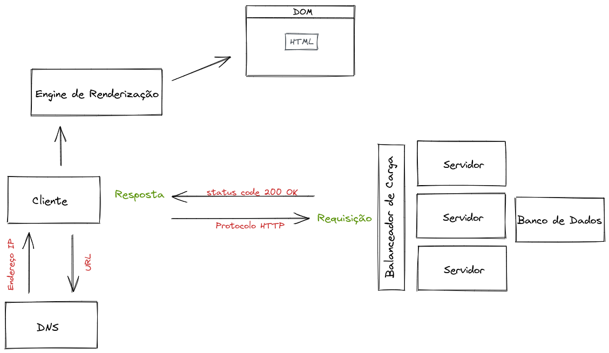

### Bloco 2 - Git, GitHub e Internet 
### Exercícios sobre a criação de repositórios no GitHub

O objetivo dos exercícios desses dias era dar os primeiros passos em Git, criando e configurando o repositório para ser utilizado ao longo do curso.

### Dia 1 - Primeiros passos no GitHub
#### Parte 1
- [x] Cria um repositório para os exercícios
- [x] Realiza as configurações iniciais
- [x] Cria um arquivo .txt com o conteúdo abaixo:
```
O que eu vou aprender na Trybe:

- Unix
- Bash
- Git
```
- [x] Inicializa o repositório com git init
- [x] Cria um arquivo de README utilizando o comando touch README.md
- [x] Cria um commit inicial
- [x] Sobe o primeiro commit com git push
- [x] Abre um Pull Request
- [x] Faz o merge das alterações

### Dia 2 - Entendendo os comandos
#### Parte 2
- [x] Cria uma nova branch
- [x] Altera o arquivo criado anteriormente para incluir novas habilidades
- [x] Cria um commit com as alterações
- [x] Sobe o commit com git push
- [x] Abre um Pull Request
- [x] Faz o merge das alterações

### Dia 3 - Internet: Como ela funciona?
- [x] Exercícios do site [Julia Evans](https://jvns.ca/blog/2019/08/27/curl-exercises/)
- [x] Cria diagrama ilustrando como a internet funciona, descrevendo as partes(protocolos, recursos, mecanismos, etc) envolvidas quando enviamos uma requisição a partir de um cliente para um servidor.


