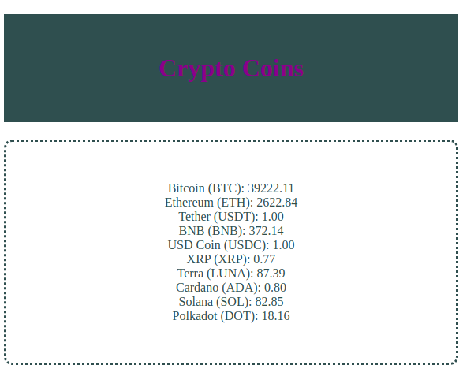

### `Bloco 9 - JavaScript Assíncrono e Promises`

### `Dia 2 - Promises`

O objetivo dos exercícios desse dia foi colocar em prática o que havia aprendido sobre JavaScript assíncrono e utilizando:

- Promises para fazer chamadas assíncronas
- then/catch
- async/await
- Integrações com APIs de terceiros

---

##### Exercício 1

O resultado é a criação de um site simples com um gerador de piadas ruins utilizando fetch e a seguinte [api](https://icanhazdadjoke.com/api).

- [x] Cria a função fetch para a requisição a API
  - [x] Adiciona o endereço da requisição, a url do serviço
  - [x] Adiciona o objeto contendo as especificações da requisição
  - [x] Converte o conteúdo do body da Response e retorna uma outra Promise
  - [x] Faz a piada aparecer no DOM da sua página

##### Exercício 2

**Cria passo a passo uma Promise:**

- [x] Instancia uma Promise
- [x] Dentro dela produz um array com dez números aleatórios de 1 a 50 e eleva todos ao quadrado
- [x] Se a soma de todos esses elementos for inferior a 8000, a promise é resolvida
- [x] No caso contrário do item anterior ela é rejeitada
- [x] Acrescenta um then, com um console.log('Promise resolvida') e um catch, com um console.log('Promise rejeitada') à Promise, para que os resultados possam ser exibidos

##### Bônus

Consulta a uma API que fornece os valores de [crypto moedas](https://docs.coincap.io/) e mostra as 10 primeiras.

- [x] Criar o arquivo (api.js) e dentro dele a função para pegar o array com as moedas
- [x] Cria o arquivo HTML (index.html) que contém a tag para listar as crypto moedas
- [x] Faz com que as moedas apareçam na página
- [x] Usa uma Higher Order Function para filtrar o array das moedas e mostrar apenas as 10 primeiras
- [x] Estiliza a página

