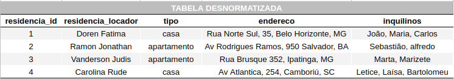
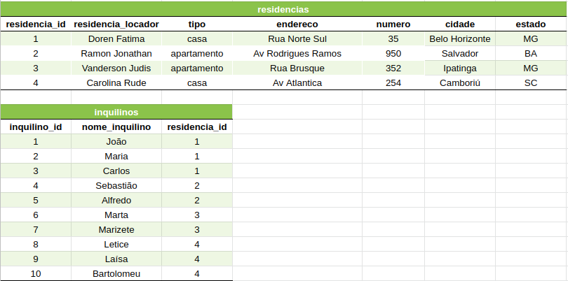
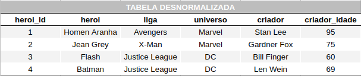
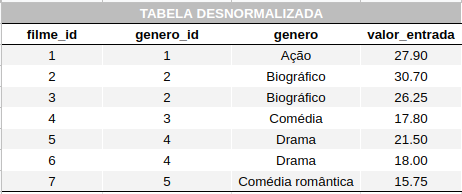

### `Bloco 22 - Normalização e Modelagem de Banco de Dados`
### `Dia 2 - Normalização, Formas Normais e Dumps`

- [x] Exercício 1: Converte a tabela desnormalizada abaixo para a 1ª Forma Normal.

Resultado:

  
- [ ] Exercício 2: Converte a tabela desnormalizada abaixo (que já está nos padrões da 1ª Forma Normal) para a 2ª Forma Normal.

  
- [ ] Exercício 3: Converte a tabela abaixo, que já está nos moldes das duas primeiras formas, para a 3ª Forma Normal.

