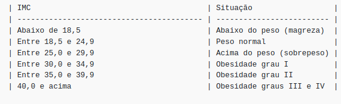

### `Bloco 26 - Introdução ao desenvolvimento Web com NodeJS`
### `Dia 1 - Node.js - Introdução`

O objetivo dos exercícios desse dia foi colocar em prática o que havia aprendido sobre Node.js, por que utilizá-lo e como criar um script simples com ele.

#### Passo 1:
- [x] Cria um pacote Node.js chamado my-scripts utilizando o comando:
```
npm init
```

#### Passo 2:
**Exercício 1**
Cria um script para calcular o Índice de Massa Corporal(IMC) de uma pessoa.
- [x] Utiliza valores fixos para peso e altura

**Exercício 2**
Permite que o script seja executado através do comando npm run imc.
- [x] O novo script criado contém o comando que chama o node para executar o arquivo imc.js

**Exercício 3**
Adiciona input de quem usa
Utilizando o pacote [readline-sync](https://www.npmjs.com/package/readline-sync#utility_methods):
- [x] Substitui os valores fixos de peso e altura por dados informados pela pessoa ao responder as perguntas "Qual seu peso?" e "Qual sua altura?" no terminal.

**Exercício 4**
Encontra solução para lidar com números nao inteiros do peso
- [x] Utiliza a solução para o peso

**Exercício 5**
- [x] Imprime o IMC na tela e também em qual categoria da tabela abaixo aquele IMC se enquadra:
Considera a seguinte tabela para classificar a situação do IMC:



**Exercício 6**
Cria um script para calcular a velocidade média de um carro numa corrida, sendo a fórmula para calcular velocidade média igual a distância / tempo.
- [x] Armazena o script no arquivo velocidade.js
- [x] Permite que o script seja executado através do comando npm run velocidade. Para isso, cria a chave velocidade dentro do objeto scripts no package.json
- [x] Utiliza o readline-sync para solicitar os dados à pessoa
- [x] Considera a distância em metros e o tempo em segundos.

**Exercício 7**
Cria um "jogo de adivinhação" em que a pessoa ganha se acertar qual foi o número aleatório gerado.
- [x] O script é executado através do comando npm run sorteio
- [ ] Utiliza o readline-sync para realizar input de dados
- [ ] Armazena o script em sorteio.js 
- [ ] O número gerado é um inteiro entre 0 e 10
- [ ] Caso a pessoa acerte o número, exibe na tela "Parabéns, número correto!"
- [ ] Caso a pessoa erre o número, exibe na tela "Opa, não foi dessa vez. O número era [número sorteado]"
- [ ] Ao final, pergunta se a pessoa deseja jogar novamente. Se sim, volta ao começo do script.

**Exercício 8**
Cria um arquivo index.js que pergunta qual script deve ser executado.
- [ ] O script é acionado através do comando npm start
- [ ] Utiliza o readline-sync para realizar o input de dados
- [ ] Quando executado, o script exibe uma lista numerada dos scripts disponíveis
- [ ] Ao digitar o número de um script e pressionar enter, o script é executado
- [ ] Utiliza o require para executar o script em questão.
