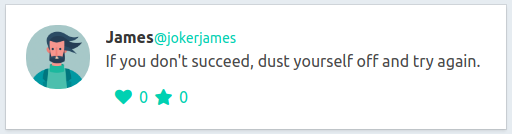

## `Bloco 30 - Sockets`

### `Dia 3 - Sockets - Socket.io`

O objetivo dos exercícios desse dia foi colocar em prática o que havia aprendido sobre a ferramenta socket.io, uma extensão de sockets, um pacote JavaScript que funciona tanto no front-end quanto no back-end que nos permite implementar ações real time na aplicação.

[Documentação do Socket.io](https://socket.io/)

#### `Objetivos`

- Conseguir desenvolver um server socket usando o socket.io
- Emitir eventos personalizados usando o socket.io

#### `Exercícios`

Para os exercícios foi utilizado o modelo de página HTML a seguir como base

#### `Exercício 1`

- [ ] Faz com que quando o cliente clicar no elemento com o id likeIcon, seja emitido um evento likePost para o servidor.

#### `Exercício 2`

- [ ] Do lado do servidor faz um listener para capturar o evento likePost que incrementa a quantidade atual de likes do post.

#### `Exercício 3`

- [ ] Emite um evento updateLikes apenas para o cliente que enviou o like enviando a quantidade atual de likes.

#### `Exercício 4`

- [ ] Modifica o código feito no exercício anterior para que o evento updateLikes seja enviado para todos os clientes conectados.

#### `Exercício 5`

- [ ] Faz com que o ícone com id starIcon emita um evento starPost e atualize a quantidade diretamente pelo front-end.

#### `Exercício 6`

- [ ] No servidor, implementa um listener para o evento starPost e emite um evento updateStars com a quantidade para todos os clientes exceto o cliente que enviou o evento.

#### `Exercício 7`

- [ ] Implementa um listener para o evento updateStars para atualizar a quantidade atual de estrelas.

#### `Bônus`

- [ ] Reestrutura a aplicação para usar a arquitetura MVC
- [ ] Refatora toda a parte do socket para permitir que seja possível fazer like especificamente em cada tweet sem afetar a quantidade dos demais.
