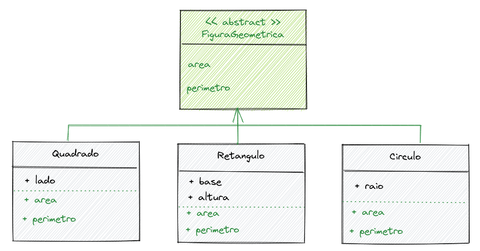
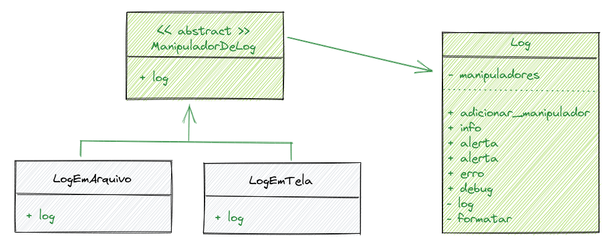
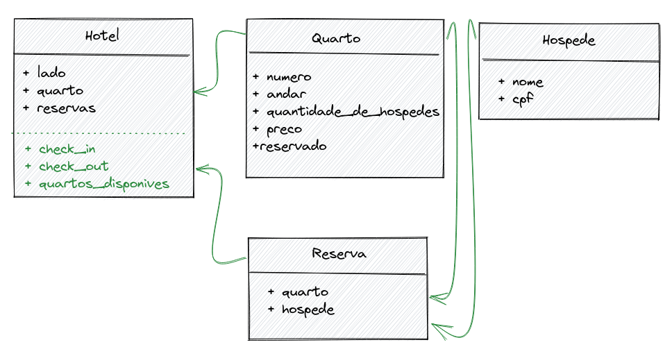

## `Bloco 34: Programação Orientada a Objetos e Padrões de Projeto`

## `Dia 2 - Herança, Composição e Interfaces`

### Exercícios

O objetivo dos exercícios do dia foi colocar em prática o que havia aprendido sobre mais alguns dos recursos importantes do paradigma de Programação Orientada a Objetos (POO), Herança, Composição e Interfaces.

- Como compartilhar lógica entre classes
- Criar versões especializadas de classes
- Como garantir consistência entre classes especializadas tendo como referência suas interfaces

#### Exercício 1

Utilizando o exercício de abstração da aula anterior, sobre o funcionamento de uma TV, implementa seus atributos e métodos, com algumas modificações.

Atributos:

- [ ] volume - inicializado com um valor de 50 e só pode estar entre 0 e 99
- [ ] canal - inicializado com um valor de 1 e só pode estar entre 1 e 99
- [ ] tamanho - inicializado com o valor do parâmetro
- [ ] ligada - inicializado com o valor de False (desligado)
- [ ] Todos os atributos são privados

Métodos:

- [ ] aumentar_volume - aumenta o volume de 1 em 1 até o máximo de 99
- [ ] diminuir_volume - diminui o volume de 1 em 1 até o mínimo de 0
- [ ] modificar_canal - altera o canal de acordo com o parâmetro recebido e lança uma exceção (ValueError), caso o valor esteja fora dos limites
- [ ] ligar_desligar - alterna o estado da TV entre ligado e desligado (True / False)

#### Exercício 2

- [ ] Define uma classe Estatistica que calcule média, mediana e moda de uma lista de números.

#### Exercício 3

- [ ] Implementa o diagrama de classes abaixo:

#### Exercício 4

Implementa um sistemas de logs por nível de severidade, seguindo o diagrama abaixo:

Classe Log

Atributos:

- [ ] manipuladores - inicializado com um conjunto de subclasses de ManipuladorDeLog

Métodos:

- [ ] adicionar_manipulador - adiciona um manipulador ao conjunto de manipuladores do gerenciamento de logs (Log)
- [ ] info - dispara logs com nível de severidade "INFO"
- [ ] alerta - dispara logs com nível de severidade "ALERTA"
- [ ] erro - dispara logs com nível de severidade "ERRO"
- [ ] debug - dispara logs com nível de severidade "DEBUG"
- [ ] __log - dispara os logs formatados para todos os manipuladores (invocado para cada nível de severidade, para evitar duplicação de código)
- [ ] __formatar - formata os logs de acordo com o padrão "[ERRO - 01/01/2020 13:00:00]: ZeroDivisionError: division by zero"
- [ ] A interface de manipulação de logs utiliza métodos de classe.

#### Exercício 5

Implementa um gerenciador simplificado de quartos de hotel conforme o diagrama a seguir:

Classe Quarto

Atributos:

- [ ] numero - número do quarto
- [ ] andar - andar do quarto
- [ ] quantidade_de_hospedes - capacidade de hospedagem do quarto
- [ ] preco - valor da hospedagem
- [ ] reservado - sempre inicializado com False, indica o estado do quarto

Classe Hospede

Atributos:

- [ ] nome - nome do hospede
- [ ] cpf - CPF do hospede (para fins de simplificação, não é necessário validar o CPF)

Classe Reserva

Atributos:

- [ ] quarto - é composto por uma instância de quarto
- [ ] hospede - é composto por uma instância de hospede

Classe Hotel

Atributos:

- [ ] nome - nome do hotel
- [ ] quartos - é composto por uma lista de instâncias de quarto
- [ ] reservas - é composto por uma lista de instâncias de reserva

Métodos:

- [ ] check_in - recebe uma quantidade indefinida de hospedes e busca por um quarto disponível com capacidade suficiente. Se houver um quarto disponível, altera o estado do quarto e cria uma reserva para cada hospede. Caso não haja quartos disponíveis deve lançar a exceção IndexError com a mensagem "Não há quartos disponíveis para essa quantidade de hospedes"
- [ ] check_out - recebe uma instância de quarto, alterando seu estado e removendo todas as suas reservas
- [ ] quartos_disponiveis - retorna uma lista de quartos disponíveis que comportam uma quantidade_de_hospedes (passado por parâmetro), priorizada da menor capacidade de hospedes possível para a maior.

Observação: todos os atributos são públicos para fins de simplificação da implementação.
